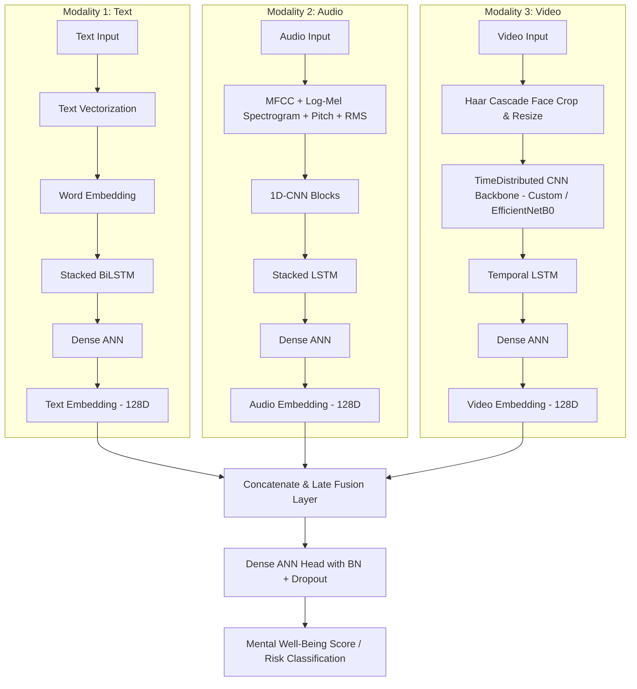

# 🧠 Talk2Mind — Multimodal Mental Well-Being Assessment

Talk2Mind is a comprehensive, multimodal mental well-being assessment platform designed to capture and analyze user emotion indicators across three key communication streams: **Text/Transcripts**, **Speech/Voice**, and **Facial Expressions/Video**. 

The system uses deep learning models trained on robust datasets (**CMU-MOSEI**, **TESS**, and **RAVDESS**) to analyze sentiment, acoustic patterns, and facial micro-expressions. These streams are combined via **late multimodal fusion** or an interactive multi-step dashboard to assess mental well-being and offer recommendations.

---

## 📸 Project Screenshots

### App Overview & Wellness Dashboard


### Multimodal Emotion Breakdown


### Additional System Interfaces
| Check-in Step & Visualizations | Training and Data Pipelines | Dataset Directory Structure |
| :---: | :---: | :---: |
|  |  |  |

---

## 📂 Project Structure

```
Talk2Mind/
├── Talk2Mind_Train_ipynb_files/
│   ├── Talk2Mind_Train_3Models.ipynb       # Google Colab notebook for unimodal training
│   └── Talk2Mind_Train_3Models_Fast.ipynb  # Fast training notebook configuration
├── models/                                 # Trained model weights, vocabulary & evaluation files
│   ├── audio_model_best.keras              # Speech Emotion Recognition (SER) weights
│   ├── text_model_best.keras               # Text Emotion Recognition weights
│   ├── text_model_final.weights.h5         # Text model final epoch weights
│   └── model_peromance.txt                 # Validation accuracy/AUC logs during training
├── talk2mind_app/                          # Full-Stack Deployment Application
│   ├── models/                             # Model directory for runtime inference
│   │   ├── text_model_final.h5
│   │   ├── audio_model_final.h5
│   │   ├── video_model_final.h5
│   │   └── text_vectorizer_vocab.pkl       # Serialized TextVectorization vocabulary
│   ├── backend/                            # FastAPI Backend API
│   │   ├── main.py                         # API routes (text, voice, face inference endpoints)
│   │   ├── model_paths.py                  # Model configuration & label mappings
│   │   ├── requirements.txt                # Backend dependencies
│   │   ├── inference/                      # Unimodal model prediction scripts
│   │   │   ├── text_infer.py
│   │   │   ├── audio_infer.py
│   │   │   └── video_infer.py
│   │   └── preprocessing/                  # Real-time feature preprocessing
│   │       ├── audio_preprocessing.py      # Audio feature extractors
│   │       └── video_preprocessing.py      # Face cropping & frame loaders
│   ├── frontend/                           # Streamlit Frontend Dashboard
│   │   ├── streamlit_app.py                # 3-Step wellness check-in wizard & dashboard UI
│   │   └── requirements.txt                # Frontend dependencies
│   ├── run_backend.bat                     # Quick-start script for Backend (Windows)
│   └── run_frontend.bat                    # Quick-start script for Frontend (Windows)
├── preprocessing/                          # Core training preprocessors
│   ├── audio_preprocessing.py              # Audio DSP pipeline
│   └── video_preprocessing.py              # OpenCV face-bounding crop and sequencing
├── models_files/                           # Modular deep learning architecture definitions
│   ├── text_model.py                       # Model 1: Embedding + BiLSTM
│   ├── audio_model.py                      # Model 2: 1D-CNN + LSTM
│   ├── video_model.py                      # Model 3: TimeDistributed CNN + LSTM
│   └── fusion_model.py                     # Late Multimodal Fusion Head
├── config.py                               # Global configuration, hyperparams, & dataset paths
├── train.py                                # Orchestrator script for unimodal and fusion training
└── requirements.txt                        # Global requirements
```

---

## 🧠 Deep Learning Architecture & Implementation

Talk2Mind relies on three unimodal feature extractors whose outputs are merged through a late-fusion neural network.



### 1. Model 1: Linguistic/Text Emotion Model (`text_model.py`)
- **Input**: Pre-tokenized integer sequences (default sequence length: `50`).
- **Layers**:
  - **Embedding Layer**: Projects integer word indices into a continuous `128`-dimensional vector space.
  - **RNN Block**: A stacked bidirectional LSTM network (first layer with `lstm_units`, second with `lstm_units // 2`) to capture bidirectional context.
  - **Dense ANN Head**: Relu-activated Dense layer (`256` units) with Dropout (`0.3`) followed by a bottleneck `128`-dimensional embedding extractor.
- **Output**: Multi-label classification (using Sigmoid and Binary Cross-Entropy loss) to predict emotions: `[happy, sad, angry, surprise, disgust, fear]`.

### 2. Model 2: Speech Emotion Recognition (SER) (`audio_model.py`)
- **Input**: Audio feature maps representing `MFCC (40 dims) + Log-Mel Spectrogram (64 dims) + RMS energy (1 dim) + Pitch/f0 (1 dim)` calculated across time steps and z-normalized.
- **Layers**:
  - **1D CNN Blocks**: Extract local acoustic patterns over time. Consists of 3 stacked `Conv1D` layers (`64`, `128`, and `256` filters) paired with `BatchNormalization` and `MaxPooling1D`.
  - **Temporal LSTM**: Integrates speech dynamics over the duration of the utterance. Uses stacked LSTMs (units: `128` -> `64`).
  - **Dense Head**: Fully connected layer leading to a `128`-dimensional speaker-emotion embedding.
- **Output**: Predicts multi-label emotion intensities.

### 3. Model 3: Facial Emotion Recognition (FER) (`video_model.py`)
- **Input**: Resized sequence of Haar Cascade-cropped face frames (default: `16` frames, `96x96` spatial size, `3` channels).
- **Layers**:
  - **TimeDistributed Backbone**: Wraps a CNN backbone so that spatial features are extracted frame-by-frame. Supported backbones:
    - *Custom CNN*: 3 blocks of `Conv2D + BatchNormalization + MaxPooling2D` ending with `GlobalAveragePooling2D`.
    - *EfficientNetB0*: Frozen pre-trained ImageNet backbone for advanced feature representations.
  - **Temporal LSTM**: Stacked LSTMs (`128` -> `64` units) to model micro-expressions and facial changes across the video clip.
  - **Dense Head**: Compiles frame features into a static `128`-dimensional visual-emotion embedding.

### 4. Late Multimodal Fusion Layer (`fusion_model.py`)
- **Concept**: Combines the semantic representations of the individual modalities.
- **Layers**:
  - **Concatenation**: Chains the `128`-dimensional text, audio, and video embedding vectors into a single joint vector of shape `(384,)`.
  - **Dense Fusion Head**: Dense layers (`256` -> `128` -> `64`) paired with `BatchNormalization` and `Dropout` (`0.4`, `0.3`, `0.2` respectively) to combat overfitting.
- **Modes**:
  - **Regression (`FUSION_TASK = "regression"`)**: Predicts a continuous wellness rating on a `0-100` scale (using MSE loss).
  - **Classification**: Categorizes user risk levels (using Softmax and Categorical Cross-Entropy).

---

## 🏋️ Training & Data Pipeline

### Datasets Used
1. **CMU-MOSEI**: Large-scale dataset of multimodal sentiment and emotion analysis. Transcripts, audio files, and annotations are used to train the Text Model and contribute to the Speech Model.
2. **Multimodel Dataset**: Combines TESS-style audio files (emotion identified in name) and RAVDESS video files (emotion encoded in filename) to train the Speech and Video models.

### Feature Extraction Preprocessing
- **Audio DSP**: Files are resampled to `16,000 Hz` and padded/truncated to exactly `4.0 seconds`. Uses librosa to compute log-mel spectograms and pitch (via `librosa.pyin`).
- **Video Preprocessing**: OpenCV reads frames, crops the largest detected face using Haar Cascades, and samples exactly `16` frames, resizing them to `96x96`.

### Running Training (Google Colab)
Open the notebook in `Talk2Mind_Train_ipynb_files/Talk2Mind_Train_3Models.ipynb` and execute step-by-step:
1. Mount Google Drive.
2. Run feature extraction helper functions.
3. Fit the `TextVectorization` vocabulary and save `text_vectorizer_vocab.pkl`.
4. Train each unimodal network. Weights are saved inside the `models/` folder.

To run training locally via CLI:
```bash
python train.py --stage all
```

---

## 🚀 Running the App (FastAPI + Streamlit)

The application provides a interactive check-in flow:
1. **Text Prompt**: Type how you are feeling.
2. **Voice Check-in**: Upload/record a WAV clip.
3. **Face Check-in**: Upload a short video clip.
4. **Dashboard**: Evaluates well-being based on the combined emotion outputs.

### Setup and Directory Deployment
1. Ensure your trained weights are inside `talk2mind_app/models/`:
   - `text_model_final.h5`
   - `audio_model_final.h5`
   - `video_model_final.h5`
   - `text_vectorizer_vocab.pkl`

2. Install dependencies:
   ```bash
   # Terminal 1 - Backend Setup
   cd talk2mind_app/backend
   python -m venv venv
   source venv/bin/activate  # On Windows: venv\Scripts\activate
   pip install -r requirements.txt

   # Terminal 2 - Frontend Setup
   cd ../frontend
   pip install -r requirements.txt
   ```

### Execution
- **Run Backend**:
  ```bash
  cd talk2mind_app/backend
  uvicorn main:app --reload --port 8000
  ```
- **Run Frontend**:
  ```bash
  cd talk2mind_app/frontend
  streamlit run streamlit_app.py
  ```
 
